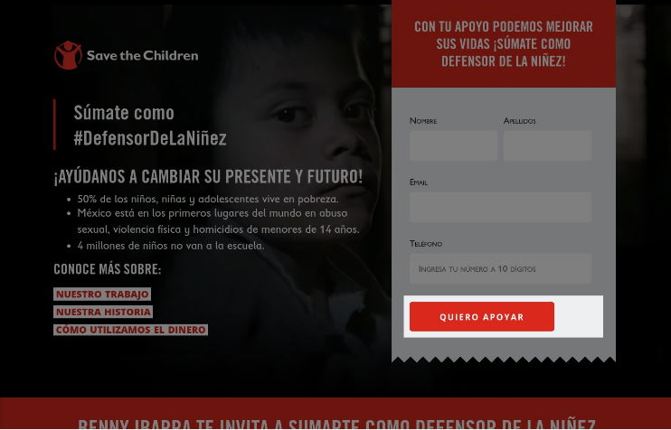

## UX Sprint 2
### Proyecto Save the Children

##### Equipo de trabajo
- Tania Sosa / UX Researcher
- Karina Quesada / UX Researcher
- Jasmín López  / UX Researcher
- Carmen Vega / UX Designer
- Adriana Dillarza / UX Designer
- Elzbeth Blanco / Product  Owner

#### Objetivo:
Mejorar el flujo de visitantes de landing page que llegan por medio de la publicidad
pagada de Google y a su vez que estos se conviertan en donadores a la causa.

#### Investigación:
- IMPLEMENTACIÓN DE USER PERSONAS
- DISEÑO Y DESARROLLO DE CUSTOMER JOURNEY MAP
- MAPA DE EMPATÍA

#### Estrategia:
Difundir la causa de Save The Children aumentando el número de visitantes a la página de  donación.
### Objetivos SMART:
- Establecer un sistema de diseño homologado para todas las campañas
- Aumentar el número de visitantes que lleguen por FB en 10% en los próximos 2 meses por medios de publicaciones
	relacionadas a los artículos de la página principal.

### Estrategia:
- Reforzar la credibilidad de Save The Children aumentando el número de visitantes para convertirlos a donantes
### Objetivos SMART:
- Incrementar la conversión de los visitantes en 20% en 3 meses mejorando la posición de los botones call to action.
- Optimizar el proceso de donación al modificar la arquitectura del formulario para reducir a menos de 5 minutos para
	completar la donación.

#### Ejercicio Generando propuestas para objetivo de negocio

- Objetivo de negocio:
  - Convertir a un mayor número de empresas locales y globales en aliados estratégicos, en un lapso de 6 meses.
- Problemas:
  - Realizar campañas de relaciones públicas para aumentar las alianzas con corporativos, y no alcanzar las metas establecidas en las alianzas.
- Causa Raíz:
  - Falta de planeación estratégica, al no definir una estrategia específica para corporativos locales y para corporativos globales.
- Métrica:
  - Porcentaje de incremento de aliados locales y globales sobre el porcentaje previo.
- Herramienta Online -
- Pregunta cerrada a usuario:
  - ¿Consideras como una estrategia de valor, crear una alianza corporativa con Save the Children México?
- Pregunta abierta a usuario:
  - ¿Cuáles son los beneficios que esperan al convertirse en aliado estratégico de Save the Children México?

## Evaluación heurística Landing, realizada con UX Check
https://apoyo.savethechildren.mx/

##### 1.- Heurística: Consistency and standards
##### Severidad: 1

##### Notas:
Los botones no están homologados en tamaño y en diálogo, el usuario no debería cuestionarse si los distintos botones significan la misma acción.
##### Recomendación:
Homologar las palabras y los estilos de los botones, ya que todos presentan la misma acción.

##### 1.- Heurística: Aesthetic and minimalist design
##### Severidad: 1

##### Notas:
Los textos son muy largos, disminuyen la visibilidad de la información relevante.
##### Recomendación:
Síntesis en la descripción de cada caso, destacar la información más importante, de esta forma la tipografía podría aumentar en tamaño y mejorar la visibilidad.

### Implementación de User Persona, primer acercamiento.

#### Prototipo Propuesta Landing Page

https://www.figma.com/file/CPGDisslrGAlXtcKZHEDMi8P/Propuesta_landing?node-id=1%3A2

## Entregables Finales

### Landig Page  basada en un Sistema de Diseño global de Save the Children

### Prototipo Propuesta de App Defensores de la Niñez

### Wireframes App

### System Design

